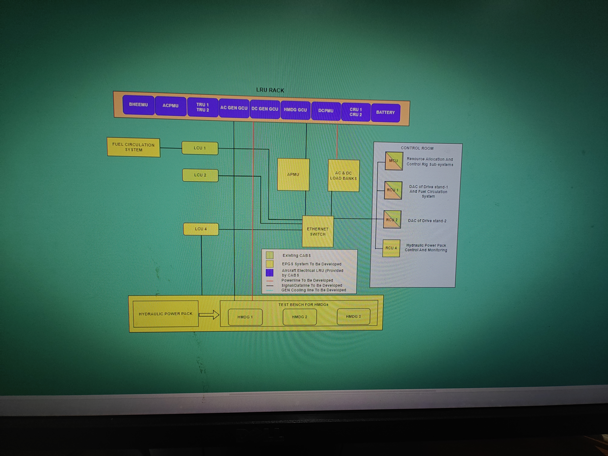
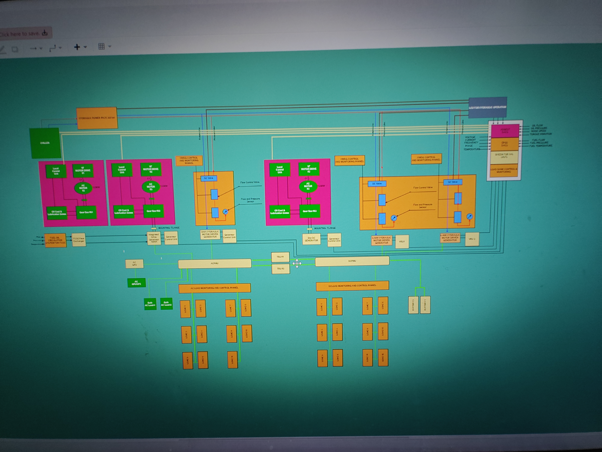
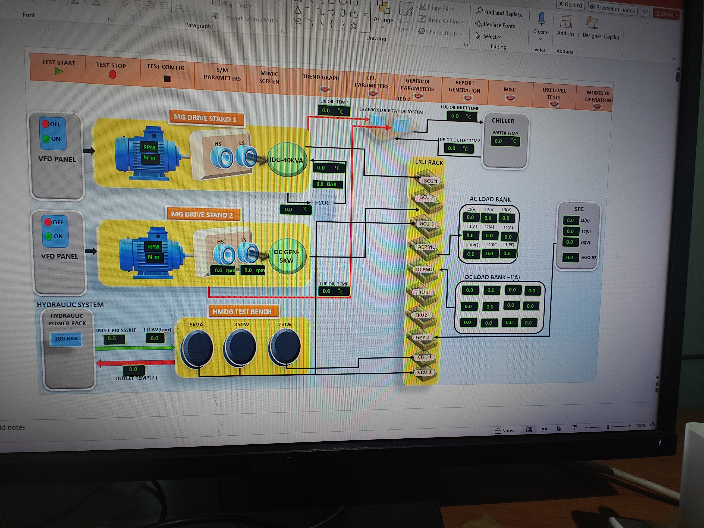
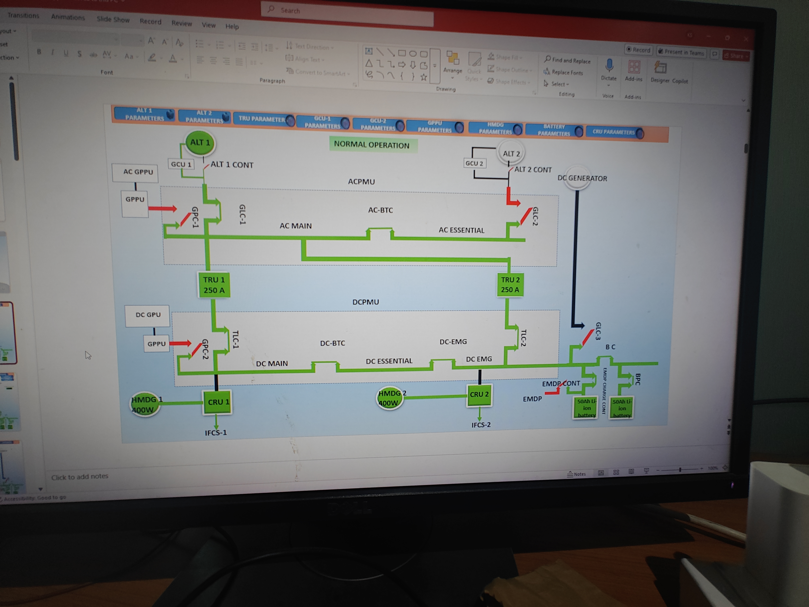
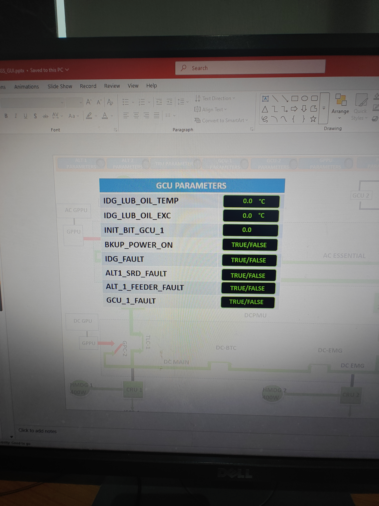

# Aircraft Generator Test Rig (EPGS)

A test rig for validating the Electrical Power Generation System (EPGS) of an aircraft, developed in collaboration with DRDO/CABS. The rig supports testing of AC/DC generators, Transformer Rectifier Units (TRUs), Hydraulic Motor Driven Generators (HMDGs), and associated LRUs under real-world load conditions.

## System Architecture

### LRU Rack & System Block Diagram

The LRU Rack hosts the primary Line Replaceable Units:
- **BHEEMU, ACPMU, DCPMU** — AC and DC Power Management Units
- **TRU 1 / TRU 2** — Transformer Rectifier Units (250 A each)
- **AC GEN GCU / DC GEN GCU** — Generator Control Units
- **HMDG GCU** — Hydraulic Motor Driven Generator Control Unit
- **CRU 1 / CRU 2** — Control and Regulation Units
- **BATTERY** — Emergency battery system

Supporting subsystems include Fuel Circulation System, LCUs (Load Control Units), APMU, AC & DC Load Banks, and an Ethernet Switch. The Control Room hosts MCU and RCUs for resource allocation and drive/fuel/hydraulic monitoring.

### Detailed Test Rig Architecture

The physical rig comprises:
- **Hydraulic Power Pack (30 kW)** with Chiller
- **MG Drive Stand 1** — AC Motor + HS/LS gearbox driving a 40 kVA IDG (AC generator)
- **MG Drive Stand 2** — AC Motor + HS/LS gearbox driving a 5 kW DC generator
- **VFD Panels** — Variable Frequency Drive panels for each drive stand
- **ACPMU / DCPMU** — with AC Load Monitoring & Control Panels and DC Load Monitoring & Control Panel
- **HMDG Test Bench** — Driven by Hydraulic Power Pack

## Control Software

### MIMIC Screen

The test rig control software provides a MIMIC screen showing real-time system state. Navigation tabs include:

| Tab | Purpose |
|---|---|
| TEST START / STOP | Test execution control |
| TEST CON FIG | Test configuration |
| S/M PARAMETERS | System/Measurement parameters |
| MIMIC SCREEN | Live rig overview |
| TREND GRAPH | Parameter trending |
| LRU PARAMETERS | Per-LRU parameter view |
| GEARBOX PARAMETERS | Gearbox telemetry |
| REPORT GENERATION | Test reports |
| MODES OF OPERATION | Operating mode selection |
| LRU LEVEL TESTS | Individual LRU tests |

The MIMIC screen displays MG Drive Stand 1 (RPM, Nm, temperature, pressure), MG Drive Stand 2, HMDG Test Bench loads (5 kVA, 350 W, 350 W), Hydraulic System (280 BAR power pack), LRU Rack, AC Load Bank, DC Load Bank, and SFC.

### Normal Operation Schematic

The normal operation power flow:
- **ALT 1** → GCU 1 → GPC-1 → AC-BTC → **AC MAIN bus**
- **ALT 2** → GCU 2 → GLC-2 → **AC ESSENTIAL bus**
- **TRU 1 (250 A)** and **TRU 2 (250 A)** → DCPMU → DC-BTC / DC MAIN / DC ESSENTIAL / DC EMG buses
- **HMDG 1 (400 W)** → CRU 1 → IFCS-1
- **HMDG 2 (400 W)** → CRU 2 → IFCS-2 → EMDP → EMDB CONT
- **SOAN Li-Ion Batteries** — emergency backup

### GCU Parameters

The GCU Parameters panel (per GCU) displays:

| Parameter | Type | Description |
|---|---|---|
| IDG_LUB_OIL_TEMP | Analog (°C) | IDG lubrication oil temperature |
| IDG_LUB_OIL_EXC | Analog (°C) | IDG lube oil exceedance |
| INIT_BIT_GCU_1 | Analog | GCU Built-In Test result |
| BKUP_POWER_ON | Discrete (TRUE/FALSE) | Backup power active |
| IDG_FAULT | Discrete (TRUE/FALSE) | IDG fault status |
| ALT1_SRD_FAULT | Discrete (TRUE/FALSE) | Alternator 1 SRD fault |
| ALT_1_FEEDER_FAULT | Discrete (TRUE/FALSE) | Alternator 1 feeder fault |
| GCU_1_FAULT | Discrete (TRUE/FALSE) | GCU 1 fault status |

## Documentation

| File | Description |
|---|---|
| `DOC/EPGS ICD AND IRS.docx` | Interface Control Document and Inertial Reference System specification |
| `DOC/PARAMETER_LIST.docx` | Complete parameter list for all LRUs (GCU, ACPMU, DCPMU, TRU, HMDG, Battery, GPPU) with signal types and ranges |
| `DOC/SCREENS FOR HLD.docx` | High Level Design screen mockups for all test scenarios (Normal, ALT1 Failure, TRU Failures, GPU Operation, etc.) |
| `DOC/RFP_...pdf` | Request for Proposal document (92 pages) |
| `DOC/system_block_diagram.jpg` | LRU Rack system block diagram |
| `DOC/test_rig_architecture.jpg` | Detailed test rig physical architecture |
| `DOC/gui_mimic_screen.jpg` | MIMIC screen of the control software |
| `DOC/aircraft_power_system_normal_operation.jpg` | Normal operation aircraft power system schematic |
| `DOC/gcu_parameters_screen.jpg` | GCU Parameters display panel |
